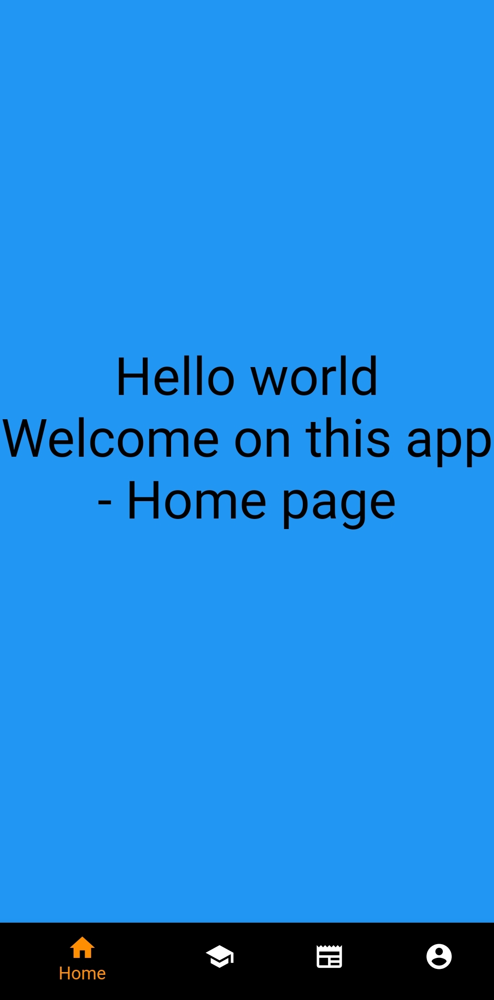

# flutter-experiments
## Introduction
This is a flutter framework test repository
Find out my own project test [here](https://github.com/Nathannicolle/flutter-experiments/tree/main/ownTest)

## Prerequisites
* Install [Flutter](https://docs.flutter.dev/get-started/install)
* Install [Android studio](https://developer.android.com/studio)
* Setup [Android Studio for Flutter](https://docs.flutter.dev/get-started/editor)

## Get project
To get the project you need to go into your desination folder and execute :  
``git clone https://github.com/Nathannicolle/flutter-experiments/``

## Try windows software version
* You can access to exe file of the test projet : [here](https://github.com/Nathannicolle/flutter-experiments/blob/main/app_release/windows/owntest.exe)
* If you want to try the software you need to have the entire folder and files : [here](https://github.com/Nathannicolle/flutter-experiments/tree/main/app_release/windows/)
* Access to current apk files released : [here](https://github.com/Nathannicolle/flutter-experiments/tree/main/app_release/apk)

## Screenshots
Home page :  
  
School page :  
  
News page :  
  
Account page :  

